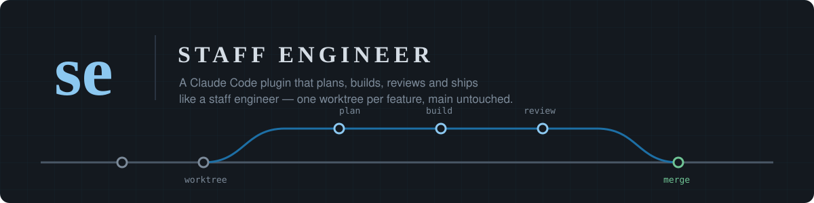
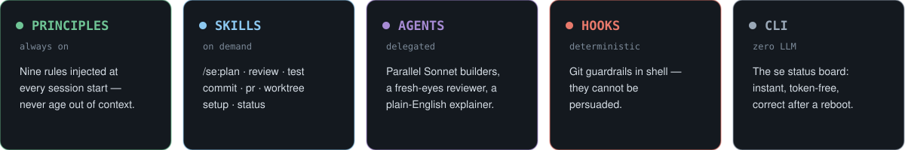
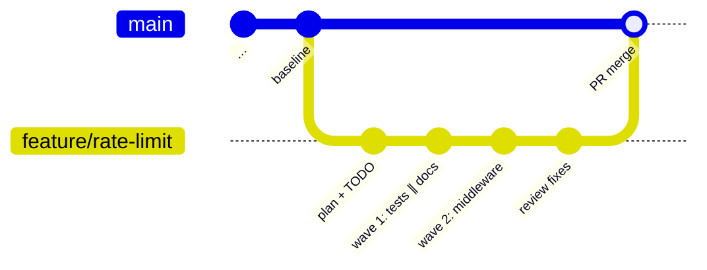
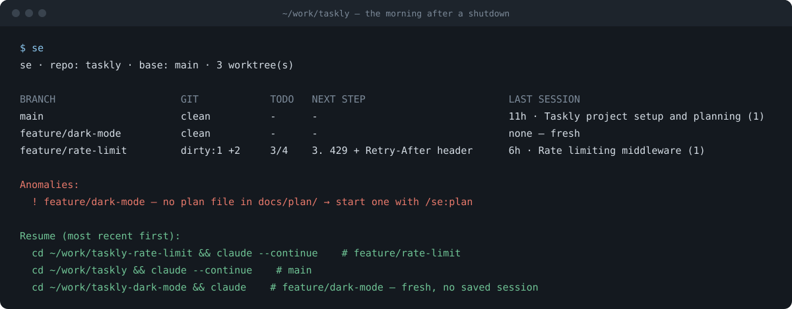

<div align="center">



<br><br>


**Plan before coding. Build in parallel waves. Review with fresh eyes.<br>
Ship through worktrees — main is never touched directly.**

</div>

---

## What is this?

`se` tunes Claude Code to work like a staff engineer. It bakes a complete
development workflow into five layers — always-on principles, on-demand
skills, delegated agents, deterministic git guardrails, and a token-free
status CLI — so every feature follows the same disciplined path from idea to
merged PR, and nothing (not even the AI's own habits) can shortcut it.



| Layer | What it does |
|---|---|
| **Principles** | Nine rules injected into context at every session start, resume, and compaction: think before coding, simplicity first, surgical changes, goal-driven execution, SOLID by default, tests are the holy grail, no agent authorship in commits, project organization, respected code |
| **Skills** | The workflow verbs, invoked as `/se:<name>` or auto-triggered when the moment matches |
| **Agents** | Parallel **Sonnet builders** implement independent plan steps; a read-only **staff-reviewer** hunts verified bugs with no memory of writing the code; a plain-English **explainer** publishes plans and reviews as readable artifact pages |
| **Hooks** | Shell guardrails on every git command — they cannot be argued with |
| **CLI** | `se` — a deterministic status board built from durable on-disk state; zero tokens, correct right after a reboot |

## Install

**Try it for one session:**

```bash
claude --plugin-dir /path/to/staff-engineer-plugin
```

**Install persistently** (the repo doubles as a one-plugin marketplace) — inside Claude Code:

```
/plugin marketplace add https://github.com/UD-UD/staff-engineer-plugin.git
/plugin install se@ujjal-plugins
```

From a local clone, use the clone's path in `marketplace add` instead. The
`se` terminal command ships in the plugin's `bin/` (on PATH for installed
plugins); to use it outside Claude Code, alias it:
`alias se='/path/to/staff-engineer-plugin/bin/se'`.

After editing the plugin: `claude plugin validate .` and `/reload-plugins`.

## Usage — one feature, start to finish



1. **`/se:setup`** *(once per project)* — scaffolds the self-contained layout:
   `scratchpad/` (gitignored agent sandbox), `docs/architecture/` (complete
   project overview + `worktree.json` setup config), `docs/decisions.md`
   (reverse-chronological decision log), `docs/plan/` (one plan per
   worktree), and a thin `CLAUDE.md` shim that routes agents into all of it.
2. **`/se:worktree`** — every feature starts here: worktree off fresh main in
   a sibling directory, config-driven environment setup (copy env files,
   symlink heavy dirs, post-create hooks), **exclusive** ports/DBs so five
   worktrees run in parallel without fighting, and a test **baseline**
   captured before any code changes.
3. **`/se:plan`** — assumptions stated out loud, 2–3 approaches weighed,
   non-goals listed, nothing speculative. Approved plans land in
   `docs/plan/<branch>.md` ending in a **wave-grouped TODO checklist** that
   gates implementation; decisions append to `docs/decisions.md`. The
   explainer agent publishes the plain-English version as an artifact page.
4. **Build in waves** — each step of the current wave dispatches to its own
   **Sonnet builder** agent in parallel (disjoint file scopes, test-first,
   red → green). The main session orchestrates: verifies each report, ticks
   the TODO, launches the next wave.
5. **`/se:review`** — the read-only staff-reviewer examines the diff with
   fresh eyes; only findings that survive verification get reported, ranked
   blocker / should-fix / consider with `file:line` and a concrete failure
   scenario.
6. **`/se:commit`** and **`/se:pr`** — atomic conventional commits (the diff
   is scanned for secrets and debug leftovers first) and a self-reviewed PR
   whose description leads with *why*.
7. **Teardown** — after the merge: pre-delete hooks stop the worktree's
   services, nothing-left-to-save check (WIP-commit or stash anything real,
   never discard), TODO ticked, then `git worktree remove` — never with
   `--force`.

### Pause tonight, resume tomorrow

Sessions persist on disk per directory, so shutting down costs nothing. Next
morning, one deterministic command shows every worktree, its TODO progress,
and the exact command to resume each Claude Code session:



Copy a resume line — that worktree's session continues with its full context.
Inside a session, `/se:status` runs the same command and helps act on the
anomaly lines.

### The guardrails in action

<details>
<summary>Real <code>git-guard.sh</code> output — click to expand</summary>

<br>

Every one of these is a `PreToolUse` hook blocking the command before git
ever runs (captured from real hook executions):

```text
$ git commit -m "feat: x"                      # while on main
Blocked: direct commits to 'main' are not allowed — features start in a
worktree (see /se:worktree). If the user explicitly approved committing to
main, prefix the command with STAFF_ENGINEER_ALLOW_MAIN=1.

$ git commit -m "feat: x
  Co-Authored-By: Claude <noreply@anthropic.com>"
Blocked: no agent authorship in commits. Rewrite the commit message without
Co-Authored-By: Claude, Claude-Session, or 'Generated with Claude Code'
attribution — the user authors their own history.

$ git commit --no-verify -m "x"
Blocked: 'git commit --no-verify' bypasses commit hooks. Fix whatever the
hook is failing on instead of skipping it.

$ git push --force origin feature/x
Blocked: plain force-push can destroy remote history. Use 'git push
--force-with-lease' if a rewrite is truly needed, and never against a
shared branch.

$ git worktree remove --force ../repo-feature
Blocked: 'git worktree remove --force' discards uncommitted work
unrecoverably. Check 'git status' in the worktree, save what matters, then
remove without --force.
```

Human co-author trailers, `--force-with-lease`, and normal commits all pass.

</details>

## Commands

| Command | What it does |
|---|---|
| `/se:setup` | Scaffold the standard layout + thin `CLAUDE.md` shim; adopts existing repos via a cleanup pass (worktree triage, CLAUDE.md migration, plan backfill, main baseline) |
| `/se:worktree` | Start a feature: worktree, isolated env, baseline, plan; safe teardown after merge |
| `/se:plan` | Staff-engineer plan → `docs/plan/<branch>.md` with wave-grouped TODO |
| `/se:review` | Verified-findings-only review of the working diff (delegates to staff-reviewer) |
| `/se:test` | Testing discipline: regression-test-first, right level, never weaken a test |
| `/se:commit` | Atomic conventional commits; secret/debug scan; no attribution, no bypasses |
| `/se:pr` | Self-reviewed PR with why-focused description and risk callouts |
| `/se:status` | Runs `se` and helps act on its anomalies |
| `se` *(terminal)* | The deterministic status board — works with or without Claude running |

## The layout it gives your projects

```text
your-project/
├── CLAUDE.md              # thin shim: summary + pointers, kept up to date
├── scratchpad/            # gitignored agent sandbox (baselines, artifacts, scripts)
├── docs/
│   ├── architecture/      # complete overview: data flow, control flow,
│   │                      # dev-environment.md, worktree.json
│   ├── decisions.md       # decision log, newest first
│   └── plan/              # one implementation plan per worktree
└── src/ …
```

## Repo layout

```text
staff-engineer-plugin/
├── .claude-plugin/        # plugin.json + marketplace.json
├── PRINCIPLES.md          # always-on principles (SessionStart hook cats this)
├── bin/se                 # deterministic status board
├── skills/                # setup · worktree · status · plan · review · test · commit · pr
├── agents/                # builder (sonnet) · staff-reviewer · explainer (sonnet)
├── hooks/                 # SessionStart → PRINCIPLES.md, PreToolUse → git-guard.sh
└── assets/                # README art
```

## Tuning

- **Principles**: edit `PRINCIPLES.md` — injected verbatim each session, so
  keep it short; every word costs context.
- **Skills**: each `SKILL.md` body is plain instructions; the `description`
  frontmatter controls auto-invocation.
- **Guardrails**: extend `hooks/scripts/git-guard.sh` (exit `2` + stderr
  blocks the tool call).
- **Agents**: `model:` and `tools:` live in each agent's frontmatter —
  builders and the explainer run Sonnet; flip to Haiku for cheaper runs.

## Credits

Config-driven worktree setup (`worktree.json` sync + lifecycle hooks) is
adapted from [opencode-worktree](https://github.com/kdcokenny/opencode-worktree) (MIT).

## Status & known limitations

First draft, evolving fast. Honest edges:

- git-guard regexes scan the whole command string, so a flag inside a quoted
  string can false-positive; `git commit -F file` messages aren't scanned.
- The guard and `se` need `python3` on PATH.
- The main-branch rule resolves the branch from the session's working
  directory; a command that `cd`s elsewhere first can evade it.
- `se` can't see sessions started from a *subdirectory* of a worktree
  (different encoded path); `~/.claude/history.jsonl` is the fallback index.
- Builder file-scope discipline is instruction-enforced, not mechanical.
